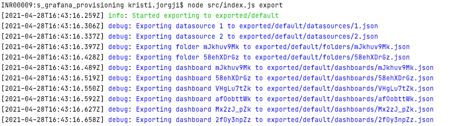

# grafana_impex

This is a grafana import/export tool that supports currently `grafana v7.1.4 (82a235b54c)`
And the following resources:
* Folders
* Datasources
* Dashboards

Can be used also with `grafonnet` to first compile json resources, then proceed and import them to grafana.

## 1. Requirements

#### 1. Bash shell or NodeJS based on version used
#### 2. Only If you want to use `grafonnet` 
If you want to use grafonnet for generating grafana json based on templates, then have to do the following steps
1. Clone in this dir the library grafonnet-lib, `git clone https://github.com/grafana/grafonnet-lib.git --depth=1` 
  
2. install [jsonnet](https://github.com/google/jsonnet#packages)


## 2a. How To Use (NodeJS Required)

First install the node package globally:
```shell
npm install -g grafana_impex@0.0.1
```

This will make available the command `gimpex` from all paths.

Then create a directory where you will store your grafana provisioning project.
```shell
mkdir grafana_provision
cd grafana_provision
```

Copy `.env.dist` in this github repository to `.env` in your created dir above, and adjust the credentials for grafana connection and auth.

1. To export all resources like `datasources, folders, dashboards` from grafana instance:

```shell
gimpex export
```


2. To import all resources to the instance specified in `.env`

```shell
gimpex import default
```

Instead of `default` you can specify the environment which you used to export.

For example `ENV=prod gimpex export` will use env file `.env.prod` and export at `exported/prod` instead of `exported/default`

Then you can import from prod exported to current connection (specified in .env) like
```shell
gimpex import prod
```

For adding secrets to datasources so they are fully configured during import see point 3.

## 2b. How To Use Only With Bash

See **[USE-WITH-BASH.md](docs/USE-WITH-BASH.md)**

## 3. Importing datasources with filled auth secrets
For this reason `jsonnet` is being used to compile templates to `json` files

See `templates/datasources-credentials/example.jsonnet`
and `templates/secrets.example.json`

Very easy and straightforward, the json you specify in datasource-credentials folder should have json format with id of datasource you want to fill with credential (you can check that form exported folder, exported/datasources), then based on the datasource type fill the secrets which are read from the secrets.json file that you can generate however you want and do not store in git or anywhere.


## 4. Playground

If you are interested in developing, contribute to this project or try it out in one easy way feel free to use the docker as instructed below.

Just to import/export against create docker throwaway container:
```shell
docker run --name play-grafana --rm -d -p 3000:3000 grafana/grafana:7.1.4
```

To stop:
```shell
docker stop play-grafana
```

## 5. License
@Kristi Jorgji MIT
Released under the MIT Licence. See the bundled LICENSE file for details.
