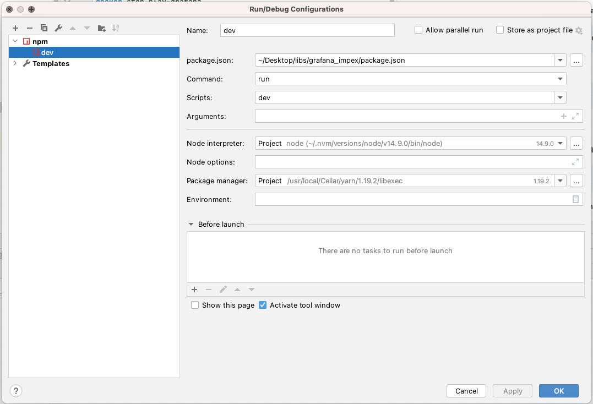

## Local Development

### Throwaway grafana instance
If you are interested in developing, contribute to this project or try it out in one easy way feel free to use the docker as instructed below.

Just to import/export against create docker throwaway container:
```shell
docker run --name play-grafana --rm -d -p 3000:3000 grafana/grafana:7.1.4
```

To stop:
```shell
docker stop play-grafana
```

### NodeJS local package development

In order to test the `gimpex` cli command,
you can link the executable with the command:
```shell
npm link
```

This will make `gimpex` cli command available from all paths.


### IntelliJ IDE

To run and debug with typescript, just create a new `npm` configuration, and choose in scripts `start`.
Then can set breakpoints in `ts` files and run in debug mode



You can also just put breakpoint in `build` folder compiled files in any case and start debug from build/index.js.
